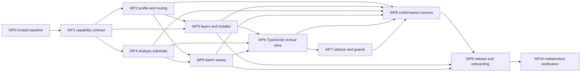

# Portable skill ecosystem completion

Turn the current Python/Django-grown ecosystem into a trustworthy portable
toolkit whose skills, routing, analysis, installation, and support claims are
correct for Python/Django, TypeScript/Node/React, Rust, Go, and mixed hosts.

This is the authoritative completion plan for the portability work identified
by the 2026-07-16 comparison of `engineering-skills`,
`engineering-skills-2`, and `engineering-skills-3`. It supersedes the
portability/distribution portions of `shareable-core-reorganization.md` and
requires explicit disposition of that plan's remaining scope; the predecessor
stays active until WP0 proves the inheritance mapping, retires it, and repairs
inbound links.

The governing distinction is:

> The toolkit runtime may remain Python. “Language agnostic” means the subject
> repository can be understood, changed, and guarded through an explicit,
> tested capability contract. It does not mean every script is rewritten in
> every language.

## How to use this file as the progress tracker

This file is both the design plan and the source of truth for execution.

1. Read **Current state**, **Open decisions**, the dependency graph, and the
   tracker before selecting work.
2. Select only a dependency-ready work package. Change its tracker status to
   `in_progress`, add an owner, and add a dated entry to the change log before
   editing implementation files. For each active package, the change log must
   name the last completed AC, current action, and last evidence revision after
   every meaningful slice; package status alone is not a sufficient checkpoint.
3. Implement the smallest slice that satisfies the package's acceptance
   criteria. Store durable evidence under
   `reports/portable-skill-ecosystem-completion/<work-package>/` and link it
   from the tracker row. Generated machine output may be JSON; reviewer
   conclusions may be Markdown.
4. The implementer may move a row to `implemented`, never directly to
   `verified`. Record every command run, its exit status, and the relevant
   artifact or concise result in the evidence record.
5. A read-only verifier with no conversation context (`fork_turns: none`)
   independently reads this plan, the changed files, and the evidence; reruns
   deterministic checks; and reports PASS or FAIL for every AC ID. Prefer
   GPT-5.6 Luna when that model is selectable; otherwise use an available
   lightweight model and record the actual verifier/model. Model preference
   must never weaken or block verification.
6. Move the row to `verified` only when all its AC IDs pass and the verifier's
   result is linked. A failure returns the row to `in_progress` and is entered
   in the change log.
7. Update the summary counts after every status change. On resumption, the
   next agent should be able to continue using this file and linked evidence
   without needing prior chat context. Every evidence record must include the
   repository revision, dirty-file list, platform, dependency/tool versions,
   command and exit status, and hashes of generated evidence. Verification
   should use a clean committed state. If an intermediate verifier must inspect
   a dirty state, the record includes a content hash for every dirty file plus
   a full patch artifact; any workspace-content change makes the evidence stale
   even when HEAD and the dirty path list are unchanged. Evidence from a
   different revision is stale until the verifier explicitly revalidates it.
   A later revision or workspace change touching an AC's implementation or
   evidence demotes its WP from `verified` to `implemented`; a fresh verifier
   may retain `verified` only by recording why the change is unrelated and
   confirming all relevant hashes.

Allowed status values:

- `not_started` — no implementation work has begun.
- `in_progress` — active work or failed verification is being addressed.
- `blocked` — a named external decision or dependency prevents progress; the
  blocker and unblock condition must be written in the tracker.
- `implemented` — implementation is complete but independent verification is
  pending.
- `verified` — every listed AC has independent PASS evidence.

Completion rules:

- Every WP0–WP10 tracker row is `verified`.
- Every acceptance criterion has a durable PASS record from a fresh-context
  verifier, including the command/output or inspection evidence used.
- All P0 decisions are resolved by accepted ADRs; no material decision remains
  only in this plan or in chat history.
- WP10's final integrator independently reruns the release gate and reports no
  missing evidence, unsupported claim, unresolved blocker, or stale tracker
  entry.
- The `/goal` may be marked complete only after those conditions hold.

## Progress summary

Last updated: 2026-07-16 by Codex (WP4 clean re-verification passed)

| State | Count |
|---|---:|
| not_started | 5 |
| in_progress | 2 |
| blocked | 0 |
| implemented | 0 |
| verified | 4 |

## Master tracker

| Work package | Status | Owner | Depends on | Acceptance criteria | Evidence / verifier | Blocker or next action |
|---|---|---|---|---|---|---|
| WP0 Trusted baseline and plan consolidation | verified | Codex | — | AC-0.1–AC-0.5 | `reports/portable-skill-ecosystem-completion/WP0/final-verification.md` (plus linked implementation/attempt/pre-retirement records) | All five ACs independently passed at clean revision `fae13d4`; next dependency-ready package is WP1. |
| WP1 Canonical stack and capability contract | verified | Codex | WP0 | AC-1.1–AC-1.7 | `reports/portable-skill-ecosystem-completion/WP1/final-verification.md` (plus implementation evidence and three retained failed attempts) | All seven ACs independently passed at clean revision `8b8b09a`; dependency-sized WP2/WP4 specs are promoted without weakening the master ledger. |
| WP2 Capability-aware host profiling and routing | verified | Codex | WP1 | AC-2.1–AC-2.6 | `ai-docs/specs/portable-host-profile-routing.md`; `reports/portable-skill-ecosystem-completion/WP2/host-profile-slice.md`; `reports/portable-skill-ecosystem-completion/WP2/adaptation-perimeter-slice.md`; `reports/portable-skill-ecosystem-completion/WP2/routing-perimeter-slice.md`; `reports/portable-skill-ecosystem-completion/WP2/final-implementation.md`; `reports/portable-skill-ecosystem-completion/WP2/verification-attempt-1.md`; `reports/portable-skill-ecosystem-completion/WP2/final-verification.md` | Fresh `/root/wp2_clean_verifier` passed AC-2.1–AC-2.6 at clean-start revision `363a818`: 506 passed/1 skip full suite, 196 focused, contract/spec/Ruff/Class A/B/C/route replay green, and independent malformed-input checks passed. WP3 is now dependency-ready; WP4 remains active independently. |
| WP3 Load-bearing layers, bindings, and installer | in_progress | Codex | WP1, WP2 | AC-3.1–AC-3.7 | `ai-docs/specs/portable-skill-layer-distribution.md`; `reports/portable-skill-ecosystem-completion/WP3/characterization.md`; `reports/portable-skill-ecosystem-completion/WP3/slice-1-evidence.md`; `reports/portable-skill-ecosystem-completion/WP3/slice-2-evidence.md`; `reports/portable-skill-ecosystem-completion/WP3/slice-3-evidence.md` | AR-1–AR-12 are characterized and IM-1–IM-6 are complete. IM-7/IM-8 functionality passed fresh review, but IM-9/AC-3.3/AC-3.4 evidence failed because replay was checkout-relative, Git bindings were trusted, selection artifacts were missing, and the active report was stale; repair commit `026980f` awaits a new verifier. IM-10–IM-12 projection commit `26a8752` awaits fresh verification; Augment/Gemini runtime discovery is available, while Claude/Codex/Cursor remain honest unresolved IM-11 risks. ADR 0042 now requires router-only default activation and bounded selected-skill delegation. Current action: finish both re-verifications, then implement portfolios and the transactional routed-activation installer. |
| WP4 Multi-language analysis substrate | verified | Codex | WP1 | AC-4.1–AC-4.6 | `reports/portable-skill-ecosystem-completion/WP4/implementation-evidence.md` (superseded benchmark narrative); `reports/portable-skill-ecosystem-completion/WP4/verification-attempt-1.md`; `reports/portable-skill-ecosystem-completion/WP4/verification-attempt-2.md`; `reports/portable-skill-ecosystem-completion/WP4/ac-4.6-repair-evidence.md` (superseded repair); `reports/portable-skill-ecosystem-completion/WP4/verification-attempt-3.md`; `reports/portable-skill-ecosystem-completion/WP4/ac-4.6-integrity-repair-evidence.md` (superseded repair); `reports/portable-skill-ecosystem-completion/WP4/verification-attempt-4.md`; `reports/portable-skill-ecosystem-completion/WP4/ac-4.6-source-provenance-repair-evidence.md`; `reports/portable-skill-ecosystem-completion/WP4/final-source-verification.md`; `reports/portable-skill-ecosystem-completion/WP4/clean-reverification.md`; `reports/portable-skill-ecosystem-completion/WP4/darwin-arm64.json`; `reports/portable-skill-ecosystem-completion/WP4/linux-x86_64.json`; `reports/portable-skill-ecosystem-completion/WP4/platform-matrix.json`; `reports/portable-skill-ecosystem-completion/WP4/adversarial-comparison.txt` | Fresh `/root/wp4_clean_reverification` passed AC-4.1–AC-4.6 at exact clean revision `d1a6316`: 549 passed full suite, 17/17 `/which-cleanup` plus root/trivial/25-file history replay, 65/65 focused on both Darwin-arm64 and Linux-x86_64, deterministic matrix and budgets green, and every retained attempt-1–4 attack rejected. WP4 is complete and parser-backed WP5 work is dependency-ready. |
| WP5 Productized batch sweep and native shims | in_progress | Codex | WP1, WP2; WP4 for parser-backed members | AC-5.1–AC-5.7 | `ai-docs/specs/portable-batch-sweep.md`; `reports/portable-skill-ecosystem-completion/WP5/characterization.md`; `reports/portable-skill-ecosystem-completion/WP5/slice-0-evidence.md`; `reports/portable-skill-ecosystem-completion/WP5/slice-1-evidence.md`; `reports/portable-skill-ecosystem-completion/WP5/slice-2-evidence.md`; `reports/portable-skill-ecosystem-completion/WP5/slice-3-command-evidence.md`; `reports/portable-skill-ecosystem-completion/WP5/slice-5-entry-evidence.md` | AR-1–AR-12 are characterized; IM-1–IM-8 and IM-12 are complete. Judgment/consumer/packet/harness code for IM-9–IM-11 is implemented at `517ac8a` but remains uncredited pending stable integrated evidence. Parser IM-14 and all subprocess/sentinel/truncation/process-group behavior passed fresh review at `6ba516e`; IM-13 failed because mutable observation scope/status were not bound to argv and completion evidence. A fourth narrow trust-boundary repair is active. Registry-owned parser selection plus strict executable-scope profiles are isolated at `4971e47` pending parser verification. Current action: finish parser re-verification, integrate registry/profile/public scan, then execute the live five-host IM-15 boundary and ADR IM-16. |
| WP6 TypeScript end-to-end vertical slice | not_started | — | WP3, WP4, WP5 | AC-6.1–AC-6.6 | — | Prove concept → detection → change → guard on a real TS fixture. |
| WP7 Language-aware refactoring and guard generation | not_started | — | WP4, WP6 | AC-7.1–AC-7.7 | — | Generalize safe changes and suppression contracts without a giant universal AST. |
| WP8 Cross-stack conformance and skill execution harness | not_started | — | WP2–WP7 | AC-8.1–AC-8.10 | — | Gate support labels and close the ordered predecessor embodiment backlog. |
| WP9 Documentation, onboarding, compatibility, and release | not_started | — | WP3, WP5, WP8 | AC-9.1–AC-9.6 | — | Make installation and claims reproducible for newcomers. |
| WP10 Independent completion verification | not_started | — | WP0–WP9 | AC-10.1–AC-10.5 | — | Fresh integrator validates every criterion and release surface. |

## Current state and problem statement

The current repository is the most advanced of the three compared versions:
it has the broadest skill corpus and the strongest architectural doctrine,
conformance tools, ADR workflow, and initial adapter/sweep work. Version 3 is
the cleanest stable baseline; version 2 is intermediate. The current repo is
also the least internally trustworthy because some documentation, generated
state, contracts, and tests lag the rapid evolution.

Audit snapshot (2026-07-16; values are evidence inputs, not eternal truths):

- 76 top-level skills. Declared coupling: 33 `any/any`, 5 `any/django`,
  15 `python/any`, and 23 `python/django`.
- Test run: 401 passed and 2 failed. One failure was environmental
  (Playwright browser binary absent); one exposed a real time-dependent test
  defect in `tests/test_triage_audit.py`.
- Only 11 of 53 script-backed skills had explicit behavior smokes; 42 passed
  only an import-floor check.
- Stale or contradictory artifacts included README skill counts and adapter
  claims, `.claude/ecosystem/last-state.json`,
  `.engineering/manifest.json` reasons, and a contract referring to a deleted
  `mature.py` implementation.
- `/which-skill` claims language/framework filtering but does not use a
  canonical host stack/capability profile.
- Stack vocabularies disagree: `skill_meta.py` accepts a narrow closed set,
  perimeter logic recognizes more values, and project adaptation can emit
  React/Vite values the metadata validator does not understand.
- `scans:` is operationally meaningful but absent from the validated
  frontmatter contract.
- The shared adapter offers symbol extraction and Python AST access; the
  JavaScript heuristic misses common ESM/TypeScript declarations such as
  `export function` and `export const`, while deep consumers remain Python
  specific.
- ADR 0034's core/language/framework/domain placement is not load-bearing:
  there is no binding loader, layer-aware manifest, core-only install, or
  verified non-Django host installation.
- ADR 0036's sweep is still a Python-oriented prototype rather than a
  supported multi-language pipeline.

Problem class: this is a **platform extraction and state transformation**,
not a metadata cleanup. It changes the toolkit from a flat, implicitly
Python/Django product into a layered host-adaptive system while preserving
existing Django behavior and skill names.

### Predecessor inheritance matrix

WP0 must verify this mapping against the current repository before retiring
the predecessor. “Separate disposition” is not permission to forget work: it
requires a named owner, accepted ADR or active plan, evidence of current state,
and a revisit/completion trigger.

| `shareable-core-reorganization` scope | Disposition in this program |
|---|---|
| W1 layer migration | WP1 capability/layer schema, WP2 routing, WP3 foundation, WP8 catalog rollout |
| W2 incidental de-flavoring | WP3 core leakage rule and WP8 full-catalog rollout |
| W3 concept + binding extraction | WP3 extract-enum exemplar, WP6 TypeScript binding, WP7 guard generation |
| W4 Class B/C de-baking | WP2 must classify and verify the component-profile, neutral-surface, and Class C scope work; unfinished items receive exact ACs in a successor spec before predecessor retirement |
| W5 ADR 0026–0030 and 0003 backlog | WP0 audits each item as implemented, rejected, or still proposed; every unfinished item is mapped to an exact AC/successor plan and owner before predecessor retirement |
| W6 on-ramp and distribution | WP3 installer plus WP9 onboarding, lite-mode/three-skill starter, compatibility, and release |

No predecessor workstream may be labeled “covered” solely because a new work
package has a similar name. The WP0 verification evidence must map each
original deliverable and success criterion, not just W1–W6 headings.

Detailed inheritance ledger (owner is the active goal coordinator until a WP
row names another owner):

| Predecessor item | Current-state finding at WP0 | Exact completion owner |
|---|---|---|
| W1 classify every skill and resolve discovery/package mechanics; ADR 0024/0028 govern rename/move commits | Not completed; ADR 0034 remains pending on the predecessor | D1/D4, AC-3.1–AC-3.6, pre-WP7 move gate AC-3.7, generalized ADR 0024/0028 behavior AC-7.1/AC-7.2, AC-8.7 |
| W1 update routers, activation manifest, perimeter, contracts index, catalog | Not layer-aware yet | AC-2.3–AC-2.5, AC-3.2/AC-3.5, AC-8.7, AC-9.1 |
| W2 de-flavor named incidentally coupled procedures by relocating Django examples/defaults and correcting frontmatter | Partial/unmeasured | Exact procedure/example/frontmatter requirements AC-3.1 and full-catalog leakage gate AC-8.7 |
| W3 concept + binding default and five named families (typed state, read mutation, unguarded dispatch, implicit relation/FK, handler LOC), with extract-enum first | Not completed | D2, inventory/exemplar AC-3.1/AC-3.3/AC-3.4, TypeScript proof AC-6.3/AC-6.6, and mandatory five-family catalog completion AC-8.7 |
| W4 descriptor-driven component inventory, graceful no-profile behavior | Implemented in `cotton_inventory.py`; must remain regression-pinned | AC-2.6 |
| W4 neutral product-health surface labels | Not completed: `product_health.py` still emits `sites_*` labels | AC-2.6 |
| W4 scope integration for folder-topology and frontend-contract detectors | Implemented through shared ignore-first scope; must remain regression-pinned | AC-2.6 |
| W4 `find-route-sprawl` clean-exemplar and already-landed Class A baseline | Existing evidence, not new implementation scope; preserve as the comparison oracle | AC-2.6 requires a WP2 snapshot plus green route-sprawl/Class A characterization tests before and after the Class B/C work |
| W5 ADR 0026 reason-mandatory project-lint suppression | Still proposed | AC-7.6 |
| W5 ADR 0027 wire-identifier preservation | Still proposed; invariant already named by refactor criteria | Behavior AC-7.1/AC-7.2 and formal disposition/embodiment AC-7.7 |
| W5 ADR 0028 post-move asset-path verification | Still proposed | Behavior AC-7.1/AC-7.2 and formal disposition/embodiment AC-7.7 |
| W5 ADR 0029 route-mirrored page topology detector | Still proposed | AC-8.8 |
| W5 ADR 0030 cohesive workflow-trio detector | Still proposed | AC-8.8 |
| W5 ADR 0003 canonical findings ledger/outcome linkage | Still proposed; overlaps ADR 0036 manifest identity and must follow 0026–0030 | AC-5.4/AC-5.5 preserve the seam; ordered formal closure AC-8.9 |
| W5/Success baseline ADR 0031 | Already accepted and embodied since the predecessor baseline; must not regress | AC-8.10 baseline/no-regression proof |
| W6 onboarding-flow as one diagram and lite three-skill starter | Not completed in the required explicit form | AC-9.2 explicitly requires both the single funnel diagram and lite portfolio |
| W6 per-stack portfolios, packaging decision, ≤20-minute first value | Not completed | D1, AC-3.5/AC-3.6, AC-9.2/AC-9.6 |
| Success 1 layer-aware non-Django install, honest routers, and perimeter coverage | Not completed | Router/perimeter AC-2.3/AC-2.5, install AC-3.5/AC-3.6, release fixture AC-9.6 |
| Success 2 no framework leakage in core | Not completed | AC-3.1, AC-8.7 |
| Success 3 extract-enum binding round-trip | Not completed | AC-3.4, AC-6.6 |
| Success 4 embodiment backlog shrinks against the stated 0026–0031 + 0003 baseline without old or new regression | ADR 0031 is already resolved; all remaining named items require ordered closure | AC-7.6/AC-7.7, AC-8.8–AC-8.10, AC-9.4 |
| Success 5 documented ≤20-minute first value and named starter | Not completed | AC-3.6, AC-9.2 |
| Success 6 reference-clean moves (`skill_meta`, contracts index, artifact drift Band A, decision audit, docs/routers/contracts) | Not completed | Move/reference mechanics AC-3.2/AC-3.7 and AC-7.1/AC-7.2; full catalog/aliases/contracts AC-8.7; exact metadata/contracts/index/docs/decision/artifact-drift release gates AC-9.1/AC-9.4 |

The predecessor W5 order remains binding: ADR 0026 → 0027 → 0028 →
0029/0030 → 0003. Therefore AC-7.6 completes before AC-7.7 (which resolves
0027 before 0028); WP7 is verified before WP8 starts; AC-8.8 completes before
AC-8.9; and AC-8.10 proves this sequence from the tracker, commits, and evidence.
There is no early-work exception inside this program: changing the order first
requires an explicit acceptance-criteria amendment and a fresh-context plan
review before implementation begins.

## 1. Scope & Bounds

### In scope

- Repair the repository's baseline trust so subsequent portability claims are
  measured against green, current artifacts.
- Define one canonical, extensible stack and capability registry consumed by
  metadata validation, project profiling, routers, perimeter auditing,
  installers, adapters, smokes, and sweep shims.
- Make ADR 0034 layers load-bearing through discovery, activation, concept
  bindings, installation, and leakage checks.
- Build language-analysis facts sufficient for portable detectors,
  refactorings, and guards, using native parsers/indexes where precision needs
  them and native linters where they are already authoritative.
- Productize ADR 0036's stable-manifest sweep with Python, TypeScript, Rust,
  and Go shims.
- Prove a complete TypeScript path before broad porting: profile → route →
  detect → propose → change → guard → rescan.
- Gate every language/framework/support claim on fixture-backed behavior and
  independently verified evidence.
- Preserve current Python/Django behavior and existing public skill invocation
  names or provide tested compatibility aliases.

### Out of scope / non-goals

- Rewriting the toolkit runtime in each supported language.
- Porting all 76 skills before the TypeScript vertical slice proves the
  architecture and reveals the real cost.
- Designing a giant universal AST. The shared layer owns bounded facts and
  capability contracts, not a lossless representation of every language.
- Maintaining full per-language copies of a concept skill.
- Restructuring host repositories merely because this toolkit adopts internal
  layers.
- Claiming production support for a stack that lacks a passing conformance
  fixture and behavior smoke.
- Building a knowledge graph, telemetry platform, or autonomous model-routing
  system unless an acceptance criterion demonstrates that a smaller indexed
  artifact cannot meet the need.

## 2. Success Criteria and work packages

### WP0 — Trusted baseline and plan consolidation

Deliverables: reproducible baseline report, repaired tests/artifacts, and one
authoritative active portability plan.

- **AC-0.1:** From a clean checkout with documented prerequisites,
  `.venv/bin/python -m pytest` exits 0. Browser-dependent tests either run
  after a documented deterministic setup command or fail preflight with a
  precise setup instruction; they are not silently skipped to obtain green.
- **AC-0.2:** The time-dependent triage test uses an injected/fixed clock or
  otherwise deterministic boundary. A regression test fails if wall-clock
  time is reintroduced into that scenario.
- **AC-0.3:** README counts/claims, `.claude/ecosystem/last-state.json`,
  `.engineering/manifest.json`, skill contracts, and actual files agree.
  Artifact-drift checks detect a contract naming a deleted implementation.
- **AC-0.4:** `scripts/plans.py audit`, `scripts/decisions.py audit`, decision
  link checks, skill metadata lint, ecosystem consistency, and the narrowest
  relevant self-lints all exit 0; exact commands are recorded in evidence.
- **AC-0.5:** Before `shareable-core-reorganization.md` is abandoned, a
  line-item W1–W6 inheritance record maps every predecessor deliverable and
  success criterion to an exact AC/successor spec or to an accepted ADR-backed
  disposition with owner and revisit trigger. A fresh-context verifier reports
  zero unmapped items. Only then is the predecessor marked `abandoned` with a
  pointer here and every active inbound reference updated or deliberately
  retained as historical provenance.

### WP1 — Canonical stack and capability contract

Deliverables: accepted ADRs for D1–D5, one registry/schema, validators, and a
machine-readable support vocabulary.

- **AC-1.1:** A versioned schema distinguishes toolkit runtime, subject
  languages, frameworks, build/test tools, project roots, layers, bindings,
  `scans`, analysis/refactoring/guard capabilities, support level, and
  evidence. Unknown future language/framework identifiers can be registered
  without editing multiple validators.
- **AC-1.2:** `skill_meta.py`, project adaptation, `/which-skill`, perimeter
  auditing, activation manifests, installer selection, and sweep shims import
  or consume the same registry. A repository search plus a guard test proves
  there is no second hard-coded stack enumeration on those paths.
- **AC-1.3:** Schema validation rejects invalid capability names, unsupported
  layer/binding combinations, `language: any` without sufficient executable
  coverage, `scans:` claims without a matching adapter/shim/evidence entry,
  and React/Vite-style framework/tool confusion.
- **AC-1.4:** Support states are explicit (`unsupported`, `experimental`,
  `verified`, or the ADR-selected equivalents) with mechanical promotion and
  demotion rules tied to fixture results and tool versions.
- **AC-1.5:** Accepted ADRs resolve D1–D5 and record rejected alternatives,
  migration compatibility, dependency/toolchain costs, and revisit triggers.
  `decisions.py audit` and link checks exit 0.
- **AC-1.6:** A versioned, machine-readable completion-floor matrix defines
  the minimum verified capabilities and supported agent surfaces for every
  target stack. The conformance gate fails when the floor below is unmet; a
  stack cannot pass by labeling required cells `unsupported` or by omitting
  them. Changes to the floor require an ADR amendment and migration impact
  review.
- **AC-1.7:** Before D3 is accepted, a time-boxed spike executes the same pinned
  syntax/semantic corpus through the viable tool candidates and records
  precision/recall, unsupported constructs, cold/warm runtime, install size,
  licenses, supported platforms, deterministic CI setup, and maintenance
  ownership. WP4 implements the selected portfolio and must meet or improve
  the predeclared acceptance budgets rather than merely recording performance.

Minimum completion floor (D4 may refine names, but not silently weaken these
outcomes):

| Host stack | Must be `verified` at program completion | May remain `experimental` |
|---|---|---|
| Python/Django | profile, routing, perimeter, installation, required analysis facts, batch sweep, enum/refactor/guard exemplar, existing applicable catalog compatibility | newly introduced optional detector families outside the current catalog |
| TypeScript/Node/React | profile, routing, perimeter, installation, real-parser symbols/imports/definitions/references/calls/writes needed by WP6, batch sweep, omnibus + typed-state detection, enum migration, executable guard | broader catalog beyond the WP6/WP7 invariant portfolio |
| Rust | profile, routing, perimeter, install selection, native sweep shim, loud failure semantics, mixed-host composition | parser-backed refactoring and non-native structural detectors |
| Go | profile, routing, perimeter, install selection, native sweep shim, loud failure semantics, mixed-host composition | parser-backed refactoring and non-native structural detectors |
| Mixed monorepo | per-root profile composition, layer/binding isolation, routing, perimeter, native sweep aggregation, stable non-colliding identities across languages | cross-language semantic refactoring |

The supported-agent-surface matrix is versioned alongside this floor. “Every
supported agent surface” elsewhere in the plan means every surface named in
that matrix at its pinned minimum version, not an open-ended claim.

### WP2 — Capability-aware host profiling and routing

Deliverables: a canonical host profile, adapter migration, explainable
routing, and honest perimeter coverage.

- **AC-2.1:** One profiler produces schema-valid deterministic profiles for
  Python/Django, TypeScript/Node/React, Rust, Go, and a mixed monorepo fixture,
  including code roots, generated/vendor exclusions, build/test commands, and
  detected evidence for every stack assertion.
- **AC-2.2:** `/adapt-project` consumes the profile and never emits identifiers
  rejected by metadata validation. It invokes `/find-perimeter-gaps` against
  the resulting profile before reporting adoption success, surfaces uncovered
  cells and visible accepted exclusions, and has fixture-backed integration
  tests proving the call cannot be bypassed. Re-running adaptation is
  idempotent and preserves host-owned instructions rather than installing
  toolkit identity text as the host's identity.
- **AC-2.3:** `/which-skill` filters by required capabilities/layers/bindings,
  explains every inclusion and material exclusion, and does not recommend a
  Django-bound skill for the TypeScript fixture. Tests prove the documented
  language/framework filtering behavior.
- **AC-2.4:** `/which-shape`, `/which-cleanup`, activation manifests, and
  `/which-skill` cannot disagree on whether a skill is active for the same
  profile; a shared conformance test checks the routing surfaces.
- **AC-2.5:** `/find-perimeter-gaps` uses the canonical registry and treats a
  root as covered only when an installed, version-compatible capability has
  executable scan evidence. Accepted exclusions require a reason and remain
  visible in output. The “audit the whole codebase” routing entry point invokes
  this audit and fails or reports incomplete coverage before presenting a
  whole-codebase conclusion; an end-to-end fixture test pins that integration.
- **AC-2.6:** The predecessor Class B/C de-baking contract is complete and
  regression-pinned: component inventory is selected by the host component
  profile and degrades to an empty inventory when undeclared; folder-topology
  and frontend-contract detectors enumerate through the shared ignore-first
  scope; and product-health records use neutral, profile-derived surface labels
  with no `sites_*`/seed-host fallback. Good/bad fixtures prove each behavior,
  and a repo search finds no executable hard-coded seed-host root on these
  paths. Before editing, WP2 evidence records the already-landed Class A test
  inventory and the current `find-route-sprawl` ignore-first discovery/output
  as the clean comparison oracle. Those Class A tests and route-sprawl
  characterization fixtures remain green after the Class B/C changes, and the
  two migrated Class C detectors have equivalence fixtures against that
  exemplar's root/scope/extension/marker-selection behavior.

### WP3 — Load-bearing layers, bindings, and installer

Deliverables: discovery-compatible layer namespace, binding contract,
compatibility aliases, install manifests, and cold-host installer.

- **AC-3.1:** A complete catalog inventory assigns every skill exactly one
  proposed validated layer, while this package migrates only the foundation
  and exemplar needed by WP6. Placement validation enforces ADR 0034's N=1
  allowance for shipping-contract layers, ≥3 threshold for domain cohesion
  folders, concept+binding default, and `/plan-skill` placement question. For
  the predecessor's incidentally coupled set—the plan-* chain,
  `refactor-subsystem`, `prevent-regression`, and every inventory sibling with
  the same shape—the universal procedure remains in core, Django-specific
  examples/defaults move to a declared binding or non-core appendix, and
  `language:`/`framework:` frontmatter is corrected to the validated honest
  values. A core-layer `SKILL.md` body may not name Django or Celery; that
  content may exist only in its declared file under `bindings/`.
  Compatibility/migration prose belongs in non-core documentation, not an
  inline exception. A diff-scoped lint and
  good/bad fixtures enforce both the content boundary and frontmatter truth.
  Full catalog rollout is gated by AC-8.7 after the TypeScript exemplar.
- **AC-3.2:** The selected discovery mechanism works in every supported agent
  surface in the versioned matrix from AC-1.6. Existing skill invocation names
  resolve unchanged or through tested aliases, and contracts/catalog links
  remain reference-clean.
- **AC-3.3:** A binding loader selects bindings from the canonical host profile,
  rejects ambiguous/incompatible bindings, and exposes the selected binding
  in execution evidence. Core procedure text is not duplicated into bindings.
- **AC-3.4:** `extract-enum` is split into a framework-neutral invariant and a
  Django binding. Before implementation, a pinned input/output baseline and
  allowed normalization rules define semantic equivalence. On the Django
  fixture the post-split result matches that oracle and existing tests pass.
- **AC-3.5:** A core-only install exposes zero Django/framework-native skills;
  a TypeScript portfolio exposes core + TypeScript + selected bindings; a
  Django portfolio preserves the current applicable catalog. Snapshot tests
  cover all three.
- **AC-3.6:** On clean fixture hosts, install, verify, update, and uninstall are
  idempotent and do not overwrite host-owned files. A newcomer reaches one
  useful verified skill run in 20 minutes or less using only documented steps
  and without reading the quality-coordination kernel document.

**User-directed context-minimal activation amendment (2026-07-16):** AC-3.5
and AC-3.6 additionally distinguish installed catalog content from ambient
activation. The default install stores the selected portfolio outside automatic
discovery and exposes exactly `which-shape` and `which-skill`; all other skill
headers/bodies load only after deterministic routing. Substantial routed work
uses a fresh no-conversation-context sub-agent with only the selected procedure,
bindings, runtime/root facts, and task-local inputs when the surface supports
it. Context/authority-dependent work and surfaces without sub-agents use a
selected-only parent fallback. Direct invocation remains available through
explicit named activation, and full ambient discovery is versioned opt-in.
Acceptance evidence must count discovered headers on all five surfaces, prove
unselected procedures remain absent from worker and parent packs, bind bounded
dispatch/result artifacts, and exercise activation/update/uninstall rollback.
This is additive and does not weaken the original portfolio, lifecycle,
first-value, alias, or five-surface runtime-discovery requirements.
- **AC-3.7:** Before any WP3 foundation or exemplar commit moves/renames a
  tracked path, a WP3-local move gate applies ADR 0024 and ADR 0028 without
  waiting for the generalized WP7 tooling. Every retired concept phrasing is
  added to a distinctively scoped `avoid:` entry; both
  `superseded_co_occurrence` and `avoid_term_hit` are clean; affected prose is
  substantively corrected; and the evidence records the exact two-band
  commands/output. For every moving self-anchored path the proposal inventory,
  target pin, tractable rewrite/unhandled report, per-batch import smoke, and
  full-diff disk scan are complete and clean; the move-tool non-rewrite list is
  read, and any fired rule is captured in the running lessons log. A fixture
  move containing retired prose and a broken self-anchored path proves this
  gate blocks the commit. AC-7.1/AC-7.2 later generalize the same behavior; they
  are not permission to defer it from WP3. This is a safety-only application of
  existing ADR 0024/0028 rules to early moves: it neither changes either ADR's
  status/`embodied_by` nor counts as W5 implementation or formal disposition.

### WP4 — Multi-language analysis substrate

Deliverables: capability-based adapters, parser/index integrations, normalized
facts, golden fixtures, and explicit failure behavior.

- **AC-4.1:** A documented analysis interface exposes only the facts required
  by real consumers—at minimum symbols, imports, definitions, references,
  calls, and writes—with per-adapter capability discovery and versioning.
  Framework facts such as routes remain bindings, not universal syntax facts.
- **AC-4.2:** WP4 implements D3's selected Tree-sitter/ast-grep and/or
  SCIP/LSP/native-compiler portfolio and reruns AC-1.7's pinned benchmark.
  Results meet the predeclared precision, performance, platform, licensing,
  and deterministic-install budgets; a budget miss reopens D3 rather than
  being accepted as a recorded limitation.
- **AC-4.3:** The TypeScript adapter uses a real parser and correctly handles
  `export function`, `export const`, classes, arrow functions, nested scopes,
  `.js/.mjs/.cjs/.ts/.tsx`, malformed input, and source locations in golden
  tests. The known heuristic under-detection is removed or explicitly retired.
- **AC-4.4:** Python behavior remains regression-pinned. Rust and Go provide at
  least the fact subset needed by their accepted sweep shims and perimeter
  claims; missing facts remain explicit capability gaps.
- **AC-4.5:** Requesting an unsupported capability produces a typed skip/error
  with adapter, file, and missing-capability context. It can never appear as a
  successful zero-finding scan. Tests inject missing/broken tools and corrupt
  parser output.
- **AC-4.6:** Golden fact files and adapter contract tests are deterministic
  across supported platforms/tool versions and meet the predeclared cold/warm
  runtime and memory budgets from AC-1.7 on representative small and large
  fixtures. Evidence records the benchmark machine and variance; exceeding the
  allowed threshold fails the criterion.

### WP5 — Productized batch sweep and native shims

Deliverables: supported sweep CLI/library, versioned manifest, native-tool
shims, diff/ratchet, and skill wiring.

- **AC-5.1:** The ADR 0036 prototype is promoted from `.claude/tasks/` to a
  supported `scripts/` package with CLI help, schema versioning, deterministic
  output order, stable IDs, unit/integration tests, and no dependency on
  prototype evidence paths at runtime.
- **AC-5.2:** Shims normalize Ruff, ESLint plus TypeScript compiler diagnostics,
  Clippy, Go vet/staticcheck (ADR-selected portfolio), and ecosystem detectors
  into the shared manifest while retaining native rule IDs, locations,
  severity, tool versions, and raw-output provenance.
- **AC-5.3:** Missing binaries, nonzero tool exits, parse failures, timeouts,
  truncated output, and schema mismatches fail loudly and distinguish tool
  failure from a clean zero-finding result. Fault-injection tests cover each.
- **AC-5.4:** `scan`, `digest`, `diff`, and `ratchet` commands reproduce ADR
  0036 semantics using D5's canonical identity rules: fixed/new/persisting sets
  are correct; deliberate accepts are auditable; improvement tightens rather
  than loosens the baseline. Adversarial/property tests cover multiple
  symbol-less instances of one native rule in one file, normalized/renamed
  paths, case behavior, hash collision handling, tool-version semantic
  changes, and manifest-schema migration without false deduplication.
- **AC-5.5:** Agents consume bounded digests and finding IDs, not raw full-repo
  findings. The harness, not the executor, performs the post-change rescan and
  rejects self-attested success without manifest evidence.
- **AC-5.6:** Python, TypeScript, Rust, Go, and mixed fixtures run through the
  final manifest/diff boundary in CI. ADR 0036 `embodied_by` points to the
  productized paths and contains no productization-pending reference.
- **AC-5.7:** Detection performs no model or network calls. Every finding that
  can enter ranking, a dashboard, a planner packet, or a fix has a recorded
  judgment outcome; judge failure/uncertainty blocks execution; raw counts
  cannot directly drive ranking, dashboards, or fixes. Planner packets contain
  finding IDs, bounded scope, recipe, verification command, expected manifest
  delta, and a bounded budget. Bypass and judge-failure integration tests prove
  each gate, and network/model-call instrumentation proves the detection stage
  is agent-free.

### WP6 — TypeScript end-to-end vertical slice

Deliverables: one complete non-Python maintenance loop proving the architecture.

- **AC-6.1:** A representative TypeScript/Node/React fixture contains pinned
  good and bad cases for an omnibus module and stringly state, uses ordinary
  ESM exports, and can run lint, typecheck, and tests deterministically.
- **AC-6.2:** `find-omnibus` uses the real TypeScript analysis capability and
  reports the pinned bad module with stable evidence while remaining silent on
  the predeclared cohesive and allowed-near-miss controls. The fixture oracle,
  including the exact expected candidate set and minimum precision/recall, is
  frozen before detector changes. A second fixture with no module system,
  tests, or consolidated infrastructure helpers must produce ADR 0032's
  `re-architect — substrate decision required` handoff rather than executable
  decomposition advice.
- **AC-6.3:** The framework-neutral enum invariant plus a TypeScript binding
  detects the pinned stringly-state case and proposes/applies an idiomatic
  typed enum migration without changing external/wire values.
- **AC-6.4:** `/prevent-regression` compiles the invariant into an executable
  ESLint or Semgrep/native guard that fails on the bad case and passes after
  migration. The guard includes tests for a near-miss that must remain allowed.
- **AC-6.5:** One command or documented orchestration executes profile → route
  → detect → judge/propose → apply → native tests → guard → rescan/diff and
  proves the expected finding was fixed with zero new findings. The orchestration
  records the module/test/helper substrate check before offering refactor work
  and refuses apply when that gate fails.
- **AC-6.6:** The Django exemplar is rerun in the same CI change and retains
  equivalent output. No TypeScript implementation detail leaks into the core
  invariant or Django binding.

### WP7 — Language-aware refactoring and guard generation

Deliverables: safe change primitives, invariant-to-guard compiler contract,
and Python/TypeScript golden transformations.

- **AC-7.1:** Rename/move/reference-edit operations use parser/index evidence,
  produce reviewable patches before apply, and are idempotent on second
  execution. Before a layout move they enumerate every conserved wire surface
  (task/job name, serialized discriminator, stored string reference, routing
  key, namespace/registry key), preserve each byte-for-byte at the new location
  through an explicit override, update only source import paths, and refuse an
  old-path re-export shim; a wire-name change requires its own accepted ADR.
  For every self-anchored path in a moving file, the proposal records presence,
  the tool safely re-derives tractable literal parent-walks and reports every
  unhandled shape, a pre-move pin test proves the intended target exists, and a
  disk-anchored detector scans the full diff after the move and blocks missing
  files/directories or file/directory type mismatches. Import success alone
  cannot satisfy the gate.
- **AC-7.2:** Python and TypeScript golden projects cover definitions,
  imports/exports, references, aliases, comments/strings, tests, and ambiguous
  symbols. For every move-induced rename, ADR 0024's distinctively scoped
  retired phrasings are present in the canonical concept's `avoid:` entries,
  both `superseded_co_occurrence` and `avoid_term_hit` are clean, and affected
  prose is corrected rather than merely deleting the old term. ADR 0027
  fixtures characterize every named wire surface,
  explicit preserved-name overrides, no old-path shim, and refusal of a wire
  rename without a separate decision; a pre-merge AST/native lint rejects a
  missing/mismatched override or layout-derived discriminator, and the shared
  contributor context links the preservation rule. ADR 0028 fixtures cover
  deeper/shallower moves, depth-agnostic paths, non-literal/unhandled shapes,
  idempotency, project-root validation, mandatory per-path pins, and full-diff
  detection of missing files, missing directories, and directory-where-file
  mismatches. The move-tool docs enumerate every deliberately non-rewritten
  reference class, a per-batch import smoke resolves exported path constants,
  and any fired path gate writes the rule/cause/application to the running
  lessons log. Unsafe ambiguity, an unreviewed unhandled shape, missing pin, or
  unresolved post-move target stops with an actionable diagnostic rather than
  a partial edit.
- **AC-7.3:** A versioned guard-generation contract maps a common invariant to
  language-native enforcement while preserving language-specific escape hatches,
  messages, test fixtures, and autofix safety. Generated guards are editable,
  deterministic, and carry provenance to the invariant.
- **AC-7.4:** At least two invariant families—typed state and read-named
  mutation or another ADR-approved pair—produce passing Python and TypeScript
  guards with bad/good/allowed-near-miss fixtures.
- **AC-7.5:** Characterization tests prove existing Python refactor/guard output
  is preserved or intentionally migrated with release notes and compatibility
  handling.
- **AC-7.6:** ADR 0026's project-lint suppression contract is resolved for the
  multi-language guard portfolio: accepted implementations use a dedicated,
  reason-mandatory project namespace without corrupting native Ruff/ESLint/
  Clippy/Go suppression semantics, or the ADR is rejected/superseded with
  fixture-backed evidence for a safer per-language contract. Empty reasons,
  unknown project codes, native/project collisions, and allowed suppressions
  have executable tests; no accepted ADR remains `pending:`.
- **AC-7.7:** Proposed ADRs 0027 and 0028 are formally resolved in that order,
  not left indefinitely proposed after their behavior lands. Each is either accepted
  with accurate `embodied_by` links to the wire-identifier and post-move asset
  verification implementation/tests, or rejected/superseded with the AC-7.2
  golden-project evidence demonstrating the selected safer invariant. Decision
  audit/link checks are clean and neither item retains a stale `pending:` path.

### WP8 — Cross-stack conformance and skill execution harness

Deliverables: fixture matrix, behavior-smoke policy, support gate, and fresh-
context verification protocol.

- **AC-8.1:** A checked-in conformance matrix maps every supported stack and
  every skill capability claim to a fixture, command, expected result, support
  level, and evidence owner. No cell says “supported” without an executable
  test or a machine-validated non-applicability reason. The gate also compares
  the matrix to AC-1.6's minimum floor and fails on a missing or downgraded
  required cell.
- **AC-8.2:** Every script-backed skill has an explicit behavior smoke, or a
  schema-valid exemption naming why import-only verification is sufficient and
  its expiry/revisit trigger. Exemptions are limited to predeclared categories,
  require an owner, expire in at most 90 days, and cannot cover a skill making
  a `verified` behavior claim. The smoke runner has a `--require-all` gate that
  fails on untested, expired, unknown, or impermissibly exempted entries.
- **AC-8.3:** Every prompt/judgment-only skill has a structured output contract
  and either a deterministic artifact validator or a representative witness
  test drawn from a versioned minimum corpus selected before harness
  implementation. The plan does not claim model judgment is fully deterministic;
  it verifies required steps/evidence, mutation boundaries, and evaluator
  uncertainty. Corpus reduction or permissive expected-output changes require
  independent approval and a recorded rationale.
- **AC-8.4:** Support promotion to `verified` requires the full relevant matrix;
  regression automatically demotes or blocks release. Tests prove a metadata
  edit alone cannot promote support.
- **AC-8.5:** Each work package's verification prompt is self-contained,
  launched with `fork_turns: none`, read-only by default, and requires a PASS/
  FAIL verdict per AC ID plus rerun evidence. Verifier identity/model and any
  unavailable checks are recorded.
- **AC-8.6:** CI executes the applicable matrix on Linux; platform-dependent
  behavior has an additional supported-platform runner or an explicit support
  limitation. Tool versions and fixture lockfiles make results reproducible.
- **AC-8.7:** After WP6 verifies the concept/binding architecture, the catalog
  migration inventory from AC-3.1 is executed or explicitly classified outside
  the completion floor. Every shipped skill has one validated placement,
  routing/installation honors it, de-flavoring is complete for core skills,
  aliases and contract paths pass, and no framework leakage lint fails. The
  predecessor's five named concept/binding families—typed state, read-named
  mutation, unguarded dispatch, implicit relation-to-explicit-FK, and handler
  LOC budget—each have a framework-neutral core procedure plus a thin Django
  binding with characterization evidence; none may be replaced by an arbitrary
  two-family sample. This is the full-rollout gate; WP3 alone does not
  authorize a pre-exemplar mass move.
- **AC-8.8:** Proposed ADRs 0029 and 0030 are each resolved rather than silently
  carried forever. For each, either accept and embody the topology/workflow
  invariant in the appropriate framework binding with detector good/bad/
  near-miss fixtures, or reject/supersede it with representative evidence that
  the rule is not portable or is subsumed by another invariant. Decision audits
  are clean and no `pending:` reference points at unfinished predecessor work.
- **AC-8.9:** Only after AC-8.8 passes, ADR 0003 is resolved against ADR 0036
  rather than left proposed: accept/amend it with one canonical finding/outcome
  ledger keyed by the stable manifest identity, or reject/supersede it with an
  ADR explaining why the manifest/event substrate replaces it. The implemented
  outcome supports cross-skill path queries and finding → judgment → packet →
  fix/commit → verification linkage, with schema/round-trip tests and accurate
  `embodied_by`.
- **AC-8.10:** A checked-in embodiment-baseline report names the predecessor's
  exact baseline set—ADRs 0026, 0027, 0028, 0029, 0030, 0031, and 0003—and its
  WP0 state. At WP8 completion, `scripts/decisions.py link-check` shows strictly
  fewer pending or empty embodiments than that stated baseline; every item has
  an accepted/rejected/superseded disposition or accurate implementation link;
  no previously embodied item (including 0031) regressed; and no new empty or
  stale `pending:` embodiment was introduced anywhere in the decision corpus.
  Commit/evidence timestamps prove the binding order AC-7.6 → ADR 0027 then
  0028 in AC-7.7 → AC-8.8 → AC-8.9. The gate fails on an order violation or a
  reduction achieved by deleting/renaming a baseline record without disposition.

### WP9 — Documentation, onboarding, compatibility, and release

Deliverables: current docs, fast onboarding, migration guide, release gate,
and retired stale provenance.

- **AC-9.1:** README, skill catalog, portability roadmap, manifests, contracts,
  ADR implementation sections, and install docs agree with generated counts,
  current support levels, adapter capabilities, and paths. A drift check guards
  values that can be generated or cross-validated. After every catalog/path
  migration, the exact reference-clean gate runs
  `.venv/bin/python scripts/skill_meta.py lint`, regenerates
  `.claude/contracts/skills/_index.yaml` with
  `.venv/bin/python .claude/skills/find-skill-intent-drift/scripts/scan.py --strict`,
  runs `.venv/bin/python .claude/skills/find-skill-artifact-drift/scripts/detect.py --gate`,
  and runs `.venv/bin/python scripts/decisions.py audit`; all exit 0, the index
  write is present in output and committed, and active docs, routers, and
  contracts contain no dangling prior skill path/name.
- **AC-9.2:** Separate core-only, Python/Django, and TypeScript/Node install
  paths are documented from a clean host through first verified result,
  update, troubleshooting, and uninstall. Two fresh-context dry runs complete
  first value in 20 minutes or less without unstated repository knowledge. The
  onboarding presents the complete discovery → install → first useful run →
  next-step funnel as one diagram and includes an explicit lite mode with a
  named three-skill starter portfolio. Each of those three skills runs
  standalone; governance is explicitly optional rather than an unstated
  prerequisite. The guide names what governance is omitted and the concrete
  cost/risk of each omission, and the timed first-value run does not require
  reading the quality-coordination kernel document, preserving predecessor W6.
- **AC-9.3:** A compatibility guide covers legacy flat paths/invocation names,
  aliases, manifest/schema migrations, binding selection changes, deprecation
  duration, rollback, and how host overlays remain host-owned.
- **AC-9.4:** Every accepted ADR touched by the program has accurate
  `embodied_by`, implementation status, verification, and supersession links.
  No `pending:` entry names completed work or a deleted path.
- **AC-9.5:** Release notes state which stacks/capabilities are verified versus
  experimental, list toolchain prerequisites and known limits, and make no
  broader “language agnostic” claim than the conformance matrix supports.
- **AC-9.6:** A release candidate installed into clean Django and TypeScript
  fixtures passes installer verification, routing, representative skill runs,
  native tests, sweep, artifact drift, and uninstall without modifying
  unrelated host files.

### WP10 — Independent completion verification

Deliverable: a durable final verification report and mechanically closed goal.

- **AC-10.1:** A fresh-context integrator audits every acceptance criterion in
  WP0–WP9 and fails
  if any tracker status, evidence link, command, verifier identity, or claimed
  result is absent, stale, non-reproducible, or scoped more narrowly than the
  criterion.
- **AC-10.2:** From clean checkouts/fixtures the integrator reruns the documented
  release gate: unit/integration tests, browser setup/tests, skill smokes,
  metadata/contracts/artifact drift, plan/ADR audits, core leakage lint,
  conformance matrix, installer portfolios, TypeScript vertical slice, and
  sweep manifest/diff/ratchet. WP10 verification runs only from a clean,
  committed checkout; dirty-state exceptions allowed for intermediate WPs do
  not apply.
- **AC-10.3:** At least one fresh-context verifier independently validates each
  work package. The final integrator did not implement the work it verifies;
  exceptions require user approval and a second independent verifier.
- **AC-10.4:** The report at
  `reports/portable-skill-ecosystem-completion/final-verification.md` contains
  a PASS/FAIL row for every AC in WP0–WP9 and AC-10.1–AC-10.3, exact
  revisions/tool versions, commands, links to evidence, limitations, and an
  explicit unsupported-claims search. AC-10.4 PASS evidence is the final
  verifier's inspection of this completed report; the report does not need to
  contain a verdict about itself and is not mutated afterward.
- **AC-10.5:** After independent PASS evidence exists for AC-10.1–AC-10.4, the
  final verifier validates the
  prepared closure state and issues a signed `READY TO CLOSE` verdict. The
  verdict explicitly confirms that every prerequisite AC through AC-10.4 has
  PASS evidence, successor specs are closure-ready, tracker transitions are
  prepared, summary arithmetic is correct, and the active goal is the goal
  named by this plan. Issuing this
  verdict itself is the durable PASS evidence for AC-10.5; it need not be
  inserted into AC-10.4's immutable report. Issuing the verdict—not changing
  tracker/spec/goal state—is the full acceptance boundary for AC-10.5.

Administrative closure protocol (runs only after AC-10.5 PASS; it is not an
acceptance criterion and therefore is not self-referential):

1. The coordinator applies the already-reviewed tracker transitions, including
   WP10 → `verified`, and sets the summary to 11 verified/0 otherwise.
2. The coordinator closes the successor specs named in the ready-to-close
   evidence and runs plan/spec/decision consistency checks while the goal is
   still active. Any failure stops closure and returns the affected WP to
   `implemented`.
3. After those checks pass, the coordinator marks the `/goal` complete as the
   final state change and reports the goal tool's final usage/result. Goal
   completion is never used as evidence for an AC.

## 3. Impact Map

| Surface | Expected change | Key consumers / evidence |
|---|---|---|
| `.claude/skills/**/SKILL.md` and bindings | placement, capability metadata, de-flavored core procedures | discovery, routing, contracts, skill catalog, smoke runner |
| `.claude/skills/_common/` | capability/binding doctrine and loader conventions | skill authors, adapters, installers |
| `scripts/skill_meta.py` and frontmatter parsers | versioned metadata and capability validation | CI, skill authoring, routers |
| `scripts/_lib/lang_adapter/` | normalized fact capabilities and real TS parsing | detectors, refactor tools, perimeter |
| project adaptation/profile scripts | canonical host profile and evidence | installer, routers, sweeps, host manifests |
| `which-*` and perimeter skills | capability/layer filtering and explanations | host skill selection |
| `.engineering/manifest.json` and activation state | layer/binding/support selection | installed catalogs, consistency checks |
| sweep prototype and `scripts/` | supported manifest pipeline and native shims | SUSPECT, GUARD, CI, convergence |
| refactor and guard tooling | language-aware transformations and native rules | REFACTOR/GUARD loop |
| `.claude/contracts/skills/` | updated paths, executable evidence, drift detection | conformance and skill quality |
| tests/fixtures/CI | stack matrix and cold-host installs | support promotion and release |
| README/docs/ADRs/plans/specs | honest support, setup, provenance | users and future agents |

Repository-wide call-site tracing is required before changing skill paths,
metadata keys, manifest fields, adapter capabilities, or public commands.
Search documentation, contracts, generated indexes, tests, fixtures, hooks,
and host-adaptation templates—not only Python imports.

## 4. Blast Radius and behavior to preserve

- Current Python/Django skill output, invocation names, host adoption, and
  conformance commands remain operational through the migration.
- Existing host-owned `CLAUDE.md`/`AGENTS.md`, settings, manifests, hooks, and
  ignore files are merged intentionally and never overwritten silently.
- Stable finding IDs remain stable across line movement and tool upgrades unless
  the schema migration explicitly documents and tests the identity change.
- Wire identifiers, database values, routes, public exports, and user-facing
  names do not change as a side effect of enum/refactor generalization.
- Missing adapters, parsers, or native tools fail visibly; a zero-finding result
  always means a successful scan over a declared scope.
- Core procedures remain framework-neutral without erasing useful framework
  guidance; bindings retain idiomatic, executable instructions.
- Git history may contain old paths, but active docs/contracts/manifests cannot
  rely on deleted implementations.

Staging rule: every work package must leave the repository releasable. Schema
changes use read-old/write-new compatibility before deleting old readers.
Path moves use aliases/redirects until all supported surfaces are verified.

## 5. Architecture Fit

- **ADR 0032:** keep concept analysis separate from language adapters, but
  graduate heuristics when they demonstrably under-detect. Capabilities and
  explicit failures extend its honesty rule.
- **ADR 0034:** core/language/framework/domain placement becomes a shipping and
  routing contract; concept + binding remains the default. The actual discovery
  mechanism is resolved by D1/D2 before moves.
- **ADR 0036:** productize zero-token detection, stable manifest identity,
  digest-bounded agent work, independent harness verification, judgment before
  fixes, and structural ratchets.
- **Quality coordination kernel:** use mechanical gates, output schemas,
  composable contracts, and independent witnesses. Model tiering follows
  harness rigor; it does not substitute for it.
- **Canonical maintenance loop:** MAP/profile → SUSPECT/detect → EXPLAIN/judge
  → REFACTOR/change → GUARD/native rule. WP6 must prove the complete loop.
- **Smallest responsible interface:** normalized facts are introduced only for
  active consumers. Language-native tools remain native behind adapters.

Architectural smells explicitly guarded against: format-equivalence gaps
(duplicate registries/writers), product-topology drift (routers disagreeing),
folder-topology decoration (layers not used by installation), missing boundary
(core vs. binding), stringly state (capability/support vocabularies), and silent
query-like mutation (profile/detection commands changing hosts unexpectedly).

## 6. Open Decisions (P0; resolve in WP1)

| ID | Decision | Required evidence | Exit artifact |
|---|---|---|---|
| D1 | Distribution/discovery: Codex plugin, versioned installer, compatible folder layout, or a composed approach | discovery tests in supported agents, offline/update/uninstall needs, alias behavior | accepted ADR + prototype |
| D2 | Binding selection and loading convention | host-profile integration, ambiguity handling, skill author ergonomics, core leakage test | accepted ADR + extract-enum exemplar design |
| D3 | Analysis tool portfolio: Tree-sitter/ast-grep and SCIP/LSP/native compiler indexes | fixture precision, install determinism, licensing, performance, semantic coverage | accepted ADR + benchmark/evaluation evidence |
| D4 | Capability/support schema and promotion thresholds | current skill metadata, stack profiler needs, conformance failure semantics, version compatibility | accepted ADR + versioned schema |
| D5 | Stable finding identity and schema evolution | path normalization, missing-symbol multiplicity, collisions, renames/moves, case semantics, tool-version changes, mixed-language namespaces | accepted ADR amendment/new ADR + adversarial identity corpus |

Decision order: D4 defines the vocabulary and completion floor; AC-1.7 supplies
the evidence for D3; D5 fixes identity before manifests become evidence; D2
consumes the capability vocabulary; D1 packages the resulting layers.
Prototypes may run in parallel, but no layer move, stable baseline, or verified
support label lands before its governing decision is accepted.

## 7. Dependency graph, milestones, and promotion



Milestones:

- **M0 — Trust restored:** WP0 verified.
- **M1 — Vocabulary frozen:** WP1 verified; D1–D5 accepted.
- **M2 — Portable substrate usable:** WP2–WP5 verified.
- **M3 — Non-Python loop proven:** WP6–WP7 verified.
- **M4 — Claims gated:** WP8 verified.
- **M5 — Releasable and independently proven:** WP9–WP10 verified.

Internal sequencing: WP5's manifest core and native shims may start after WP1
and WP2; only its parser-backed ecosystem members wait for WP4. WP3 builds the
layer/binding/installer foundation and one exemplar before WP6; the full catalog
migration is deliberately delayed to AC-8.7 so the exemplar can invalidate the
design without forcing a mass rollback.

Promotion strategy: after WP1 resolves the P0 decisions, use `/plan-spec` to
create dependency-sized successor specs rather than one multi-month omnibus
spec. Record their IDs here and in the tracker. This plan remains the master
completion ledger until WP10, even when implementation details move into specs.

## Risk register

| Risk | Detection | Mitigation / stop condition |
|---|---|---|
| Metadata-only portability | support claim exists without executable fixture | AC-1.3, AC-8.4, and release unsupported-claims search block promotion |
| Duplicate stack vocabularies | same concept enumerated in multiple routers/validators | one registry plus search/guard in AC-1.2 |
| Silent parser/tool failure reported as clean | zero findings with missing/broken adapter | typed failure and fault injection in AC-4.5/AC-5.3 |
| Framework leakage into core | Django/React APIs appear in core procedure | binding boundary and diff lint in AC-3.1 |
| Premature generic IR | shared fact model grows without two consumers | require named consumers and ADR justification for each capability |
| Toolchain/licensing/CI cost | parser/index cannot install reproducibly | D3 evaluation; reject tools that cannot meet CI/install budget |
| Fixture overfitting | synthetic tests pass, ordinary projects fail | cold-host fixtures plus at least one representative external-shaped corpus |
| Breaking skill discovery/path identity | nested moves hide skills or break contracts | D1 prototype, aliases, artifact-drift and supported-agent discovery tests |
| Scope expansion to all skills/languages | work spreads before vertical slice proves value | WP6 gate; portfolio expansion after measured exemplar only |
| Independent verifier rubber-stamps evidence | verifier reads implementer narrative only | fresh context, read-only reruns, per-AC verdict, final integrator |
| Long-running work becomes unresumable | tracker/evidence not updated | change-log and status update are part of each package completion gate |

## Verification protocol template

Every verifier prompt must include: repository root, `.venv/bin/python`, plan
path, work package/AC IDs, revision, evidence paths, exact expected commands,
read-only instruction, and this required response schema:

```text
Verifier: <agent id and actual model if known>
Revision: <git revision plus dirty-file list>
Workspace state: <clean, or content hash per dirty file + full patch artifact>
Platform: <OS/architecture and supported-surface version>
Toolchain: <dependency and native-tool versions>
Work package: <WPn>
AC-n.n: PASS|FAIL — <rerun/inspection evidence>
...
Evidence hashes: <path = digest>
Missing or ambiguous evidence: <none or list>
Unsupported claims found: <none or list>
Overall: PASS|FAIL
```

The implementer must not paraphrase a FAIL into success. If a check cannot run,
the criterion remains unverified unless the criterion itself explicitly permits
inspection evidence and the verifier explains why that evidence is sufficient.

## Adversarial plan-review disposition

Fresh-context (`fork_turns: none`), read-only reviewers assessed the initial
draft and successive revisions on 2026-07-16. Earlier passes returned
`NOT READY` with the findings below; after correction, the final bounded gate
reported no P0 blockers and returned `READY`.

| Priority/finding | Disposition in this revision |
|---|---|
| P0 predecessor scope could disappear | Added line-item inheritance protocol, W1–W6 mapping, and stronger AC-0.5. |
| P0 no minimum support floor | Added AC-1.6 and explicit per-stack completion floor consumed by AC-8.1. |
| P0 ADR 0036 central commitments absent | Added AC-5.7 for agent-free detection, mandatory judgment, no raw-count consumers, and planner packets. |
| P0 stable identity ambiguous/collision-prone | Added D5 and adversarial identity/schema migration requirements to AC-5.4. |
| P0 final closure circular | Initial fix separated the ready-to-close verdict; the readiness recheck below caught and removed the remaining state-transition circularity. |
| P1 D3 evidence/dependency inversion | Added pre-decision AC-1.7 spike; AC-4.2 now implements and rechecks its budgets. |
| P1 mass layer move before exemplar / unnecessary sweep blocking | Split WP3 foundation from AC-8.7 rollout; documented WP5 internal sequencing. |
| P1 ADR 0032/0034 obligations missing | Added substrate failure fixture to AC-6.2/6.5 and authoring/N=1/≥3 rules to AC-3.1. |
| P1/P2 gameable/stale evidence | Added pinned oracles/budgets, bounded smoke exemptions, preselected witness corpus, versioned surface matrix, and revision/platform/tool/hash evidence fields. |
| Readiness recheck: ADR 0032 perimeter entry points missing | AC-2.2 and AC-2.5 now require fixture-backed `/adapt-project` and whole-codebase-audit invocation. |
| Readiness recheck: closure still circular | AC-10.5 now ends at `READY TO CLOSE`; state transitions moved to a non-AC administrative protocol, with goal completion last. |
| Readiness recheck: weak slice checkpoints/stale-state transition | Usage rules now require per-slice AC/action/revision checkpoints and demotion/revalidation on relevant revisions. |
| Final recheck: AC-10.4/10.5 evidence still cross-referenced | AC-10.4's immutable report ends at AC-10.3; independent inspection proves AC-10.4, then the signed ready verdict proves AC-10.5. |
| Final recheck: dirty files could change at the same HEAD/path list | Clean committed verification is preferred and mandatory for WP10; intermediate dirty evidence requires per-file hashes and a full patch, with demotion on any content change. |
| Final bounded gate | Fresh-context reviewer reported no remaining P0 blocker in closure linearity, dirty-state invalidation, perimeter entry points, or tracker completion rules; verdict `READY`. |

## Change log

| Date | Actor | Change | Tracker effect |
|---|---|---|---|
| 2026-07-16 | Codex | Created master plan from the comparative repository and portability audit. | All WP0–WP10 initialized `not_started`. |
| 2026-07-16 | fresh-context adversarial reviewer + Codex | Reviewer returned `NOT READY`; incorporated all five P0 findings and the concrete P1/P2 amendments listed above. | No implementation status change; plan readiness requires a second independent check. |
| 2026-07-16 | second fresh-context readiness verifier + Codex | Recheck found two blockers; added perimeter entry-point tests and separated AC verification from administrative closure, plus checkpoint/staleness rules. | No implementation status change; structural validation rerun. |
| 2026-07-16 | final fresh-context readiness verifier + Codex | Final check exposed residual AC-10.4/10.5 evidence coupling and same-HEAD dirty-state staleness; linearized evidence and strengthened workspace hashing/clean-checkout rules. | No implementation status change; final readiness recheck required. |
| 2026-07-16 | final bounded fresh-context gate | Reported no P0 blocker and returned `READY`. | Plan approved for `/goal` creation; implementation remains `not_started`. |
| 2026-07-16 | Codex | Started WP0 at HEAD `ad685e3f47fd6fb3debe4880735a5bf20eb79cae`; only dirty path is this new plan file. Current action: AC-0.1 full baseline; last completed AC: none; last evidence revision: none. | WP0 → `in_progress`; summary now 10 not started / 1 in progress. |
| 2026-07-16 | Codex | Repaired the browser prerequisite documentation, deterministic triage clock, stale contracts/state/counts/manifest labels, decision revisit triggers, and contract artifact-drift coverage; mapped and retired the predecessor at implementation commit `9eecd1e`. Last completed AC by implementer: AC-0.4; current action: fresh-context AC-0.1–AC-0.5 verification; last evidence revision: `9eecd1e`. | WP0 → `implemented`; summary now 10 not started / 1 implemented. |
| 2026-07-16 | `/root/wp0_fresh_verifier` | Fresh-context revision `8c7e9b2` passed AC-0.1–AC-0.4 and failed AC-0.5: three active references remained stale, W3 lost three of five named families, ADR 0027/0028 lacked formal disposition, W6 lost its one-diagram deliverable, and retirement sequencing was unsupported. Current action: repair those exact gaps and verify mapping before re-retirement; last evidence revision: `8c7e9b2`. | WP0 → `in_progress`; summary now 10 not started / 1 in progress. |
| 2026-07-16 | `/root/wp0_preretirement_mapping` | Pre-retirement revision `dac41d0` returned `FAIL — DO NOT RETIRE`: W2 relocation/frontmatter and literal leakage rules were weak, ADR 0027/0028 behavior was partial, Success 6's four exact commands existed only in ledger prose, and the consistency plan used an ambiguous W7 label. Current action: make each requirement executable in AC text and repeat zero-unmapped review; last evidence revision: `dac41d0`. | No status-count change; predecessor remains `scoped`, WP0 remains `in_progress`. |
| 2026-07-16 | `/root/wp0_preretirement_recheck` | Pre-retirement revision `3c84750` returned `FAIL — DO NOT RETIRE`: WP3 moves could precede the ADR 0024/0028 gate, ADR 0024's exact two-band/prose requirements were partial, the inherited W5 order was inverted by early ADR 0003 closure, and Success 4 lacked the exact 0026–0031 + 0003 baseline regression comparison. Current action: add the pre-WP7 move gate, preserve the declared order, and add the baseline-relative closure gate; last evidence revision: `3c84750`. | No status-count change; predecessor remains `scoped`, WP0 remains `in_progress`. |
| 2026-07-16 | `/root/wp0_preretirement_final` | Pre-retirement revision `3042c39` returned `FAIL — DO NOT RETIRE`: route-sprawl/Class A baseline facts lacked preservation criteria; the WP3 safety gate was ambiguous with formal W5 order and an ADR escape weakened that order; lite mode did not say standalone/governance optional; first value did not exclude kernel reading; and one status-projection owner was stale. Current action: make baseline preservation and onboarding claims exact, distinguish safety from embodiment, remove the order escape, and repair the owner; last evidence revision: `3042c39`. | No status-count change; predecessor remains `scoped`, WP0 remains `in_progress`. |
| 2026-07-16 | `/root/wp0_preretirement_gate` | Pre-retirement revision `771c3db` passed every W1–W6 and Success 1–6 mapping but returned `FAIL — DO NOT RETIRE` because one active status-projection sentence still said ADR 0003 landed with W5 instead of AC-8.9/WP8. Current action: correct that sole contradiction and repeat the zero-unmapped gate; last evidence revision: `771c3db`. | No status-count change; predecessor remains `scoped`, WP0 remains `in_progress`. |
| 2026-07-16 | `/root/wp0_zero_unmapped` + Codex | Fresh-context revision `25fab54` passed W1–W6, Success 1–6, all acceptance amendments, and active/hidden reference inspection with `ZERO UNMAPPED — READY TO RETIRE`. The next commit records the signed verdict and retires the predecessor; current action: final full WP0 verification; last evidence revision: `25fab54`. | Predecessor → `abandoned`; WP0 → `implemented`; summary now 10 not started / 1 implemented. |
| 2026-07-16 | `/root/wp0_final_verifier` + Codex | Final fresh-context verification at clean revision `fae13d4` reran all required commands and issued PASS for AC-0.1–AC-0.5 with no missing evidence or unsupported claims. Current action: start WP1; last evidence revision: `fae13d4`. | WP0 → `verified`; summary now 10 not started / 1 verified. |
| 2026-07-16 | Codex | Started WP1 after verified WP0 checkpoint `c53bb7d`. Last completed AC: none; current action: inventory current registries/discovery surfaces and produce D1–D5 decision evidence; last evidence revision: none. | WP1 → `in_progress`; summary now 9 not started / 1 in progress / 1 verified. |
| 2026-07-16 | Codex | Implemented AC-1.1–AC-1.7 across commits `3531214`, `fe0f226`, `f396c54`, and `a40d478`: one registry and strict compatibility schema, seven guarded consumers, mechanical support/floor gates, accepted D1–D5 ADRs, a generated surface prototype, a pinned D3 spike, and finding identity v2. Full suite: 426 passed/1 unrelated skip. Current action: clean committed fresh-context verification; last implementation evidence revision: `a40d478`. | WP1 → `implemented`; summary now 9 not started / 1 implemented / 1 verified. |
| 2026-07-16 | `/root/wp1_fresh_verifier` | Fresh-context revision `e20e521` passed AC-1.1/1.5/1.7 and failed AC-1.2/1.3/1.4/1.6. Adversarial probes proved dictionary registries escaped the guard, evidence strings and self-reported booleans were forgeable, and bare `verified` labels gamed the floor. Current action: bind every claim to validated artifacts and expand the guard; last evidence revision: `e20e521`. | WP1 → `in_progress`; summary now 9 not started / 1 in progress / 1 verified. |
| 2026-07-16 | Codex | Corrected all four failed paths at implementation revision `fe083d5`: recursive/constructor registry guards; contained, hashed, directly executed per-subject evidence; exact claim binding; registry-owned tool executables/arguments/version ranges; timeouts/platform/scan ceilings; and evidence-backed, version-pinned completion cells whose structural-only mode cannot pass. Full suite: 439 passed/1 unrelated skip; all metadata, plan, ADR, consumer, Ruff, D1 projection, and D3 budget checks passed. Last completed AC by implementer: AC-1.7; current action: clean zero-context re-verification of every AC; last evidence revision: `fe083d5`. | WP1 → `implemented`; summary now 9 not started / 1 implemented / 1 verified. |
| 2026-07-16 | `/root/wp1_reverification` | Fresh-context revision `4519e6a` again passed AC-1.1/1.5/1.7 and failed AC-1.2/1.3/1.4/1.6. Executable probes bypassed the guard with split/zip registries, reused one generic print-only test across subjects and all 49 floor/surface claims, accepted an unrelated nonempty scan script, and promoted a claimant-owned fake `node` binary by basename. Current action: make registry detection evaluate static computed collections, bind scan implementations and distinct subject/cell evidence, and require discovered native tool paths; last evidence revision: `4519e6a`. | WP1 → `in_progress`; summary now 9 not started / 1 in progress / 1 verified. |
| 2026-07-16 | Codex | Closed the second verifier's four bypasses at implementation revision `e80456a`: statically computed split/zip/dict registries are guarded; portable subjects require distinct executed tests and canonical claim observations; each scan implementation is path/hash/mechanism-bound, support-attested, and directly executed; native tools must resolve to registry-discovered executables; and `verified`/the full floor require a WP8-owned pinned conformance issuer that remains honestly unavailable. Full suite: 445 passed/1 unrelated skip; all metadata, plan, ADR, consumer, Ruff, D1 projection, and D3 budget checks passed. Last completed AC by implementer: AC-1.7; current action: third clean zero-context verification; last evidence revision: `e80456a`. | WP1 → `implemented`; summary now 9 not started / 1 implemented / 1 verified. |
| 2026-07-16 | `/root/wp1_final_reverification` | Fresh-context revision `dde997d` passed AC-1.1/1.3/1.5/1.6/1.7 and failed AC-1.2/1.4. Comprehension/generator/computed-receiver/`dict.fromkeys` registries escaped, and prepending claimant binaries to ambient `PATH` redefined “discovered” native tools. The distinct-subject/scan model and WP8 verification-issuer boundary passed adversarial replay. Current action: cover simple computed AST containers and replace ambient-PATH trust with a pre-claim trusted discovery snapshot; last evidence revision: `dde997d`. | WP1 → `in_progress`; summary now 9 not started / 1 in progress / 1 verified. |
| 2026-07-16 | Codex | Closed the third verifier's remaining paths at implementation revision `14eaa3a`: the guard now evaluates comprehension/generator sources, computed string receivers, generic call arguments, and `dict.fromkeys`; native executable discovery uses an immutable module-load/process-start `PATH` snapshot, with the caller/CI sanitation boundary explicitly assigned to WP8. Claim-time `PATH` poisoning tests pass. Full suite: 446 passed/1 unrelated skip; metadata, plan, ADR, consumer, Ruff, D1, and D3 checks remain green. Last completed AC by implementer: AC-1.7; current action: fourth clean zero-context verification; last evidence revision: `14eaa3a`. | WP1 → `implemented`; summary now 9 not started / 1 implemented / 1 verified. |
| 2026-07-16 | `/root/wp1_concise_verifier` + Codex | Final fresh-context revision `8b8b09a` reran the full suite, 36 focused tests, 21 retained attacks, all audits/guards/Ruff, D1 projection/plugin validation, and D3 budgets; issued PASS for AC-1.1–AC-1.7 with no blockers or unsupported WP1 claims. Current action: scaffold dependency-sized child plans/specs under the master ledger; last evidence revision: `8b8b09a`. | WP1 → `verified`; summary now 9 not started / 2 verified. |
| 2026-07-16 | Codex | Promoted dependency-sized successor plans/specs for WP2 (`portable-host-profile-routing`, AC-2.1–AC-2.6) and WP4 (`portable-analysis-substrate`, AC-4.1–AC-4.6), preserving the master acceptance wording and recording audited code roots. Current action: audit the specs and begin characterization. | No status-count change; WP2 and WP4 remain `not_started` until their implementation checkpoints are recorded. |
| 2026-07-16 | Codex | Started WP2 and WP4 from clean revision `db0fed1` after their shared WP1 dependency passed. Current actions are the mandatory pre-change characterization oracles in each successor spec; last completed AC: none; last evidence revision: none. | WP2 and WP4 → `in_progress`; summary now 7 not started / 2 in progress / 2 verified. |
| 2026-07-16 | Codex | Implemented WP4 at revision `e30fcb4`: versioned canonical fact requests, typed contextual failures, parser-backed JS/TS/TSX/Rust/Go providers, Python compatibility, deterministic goldens, exact D3 rerun, and enforced small/large runtime-memory-variance budgets. Full suite: 465 passed/1 unrelated browser skip; spec coverage/inventory, plans/ADRs, Ruff, and all product/D3 budgets passed. Current action: clean fresh-context AC-4.1–AC-4.6 verification; last evidence revision: `e30fcb4`. | WP4 → `implemented`; summary now 7 not started / 1 in progress / 1 implemented / 2 verified. |
| 2026-07-16 | Codex | Implemented the first WP2 slice at `38f9c6c`: a deterministic, versioned, registry-backed host profile for Python/Django, TypeScript/Node/React, Rust, Go, and mixed monorepos, with reason-bearing exclusions, commands, code roots, per-assertion evidence, and content validation. Focused tests: 5 passed; Ruff passed. Current action: integrate the profile into host-owned/idempotent adaptation and mandatory perimeter; last completed AC: none; last evidence revision: `38f9c6c`. | WP2 remains `in_progress`; no summary-count change. |
| 2026-07-16 | `/root/wp1_final_reverification` | Fresh-context verification of clean revision `2029139` passed AC-4.1–AC-4.4 and failed AC-4.5/AC-4.6. Adversarial probes exposed untyped malformed-root paths, no substrate-enforced blocking deadline, silent unknown/`.jsx` discovery, an already-warm “cold” benchmark, incomplete location goldens, imprecise Python symbol columns, and no executed second-platform evidence. Current action: correct every failed path and rerun exact verification; last evidence revision: `2029139`. | WP4 → `in_progress`; summary now 7 not started / 2 in progress / 2 verified. |
| 2026-07-16 | Codex | Repaired every WP4 attempt-1 defect at `d12b730`: strict registry-parity discovery, a substrate-enforced blocking-parser deadline, typed malformed-root/traversal failures, full-shape golden hashes, precise Python symbol spans, fresh-subprocess cold measurement, fixture rationale, and an explicit platform-claim matrix. Focused suite: 52 passed; full suite: 477 passed/1 unrelated skip; Ruff and all product budgets passed. Current action: clean fresh-context AC-4.1–AC-4.6 re-verification; last evidence revision: `d12b730`. | WP4 → `implemented`; summary now 7 not started / 1 in progress / 1 implemented / 2 verified. |
| 2026-07-16 | `/root/wp4_reverification` | Fresh-context revision `11164af` passed AC-4.1–AC-4.5 and failed AC-4.6. Every attempt-1 parser/routing/deadline/golden/span/cold-process defect passed replay, but a hard-coded single-platform matrix cannot prove cross-platform determinism and the synthetic 40-line large fixture is not a representative external-shaped corpus. Current action: derive platform records from execution, add an external-shaped corpus, and obtain a linked Linux-x86_64 run at the exact revision; last evidence revision: `11164af`. | WP4 → `in_progress`; summary now 7 not started / 2 in progress / 2 verified. |
| 2026-07-16 | Codex | Implemented profile-driven, host-owned, idempotent, perimeter-gated adaptation at `bfc6d86`. Canonical host-profile mode now requires registry-compatible hashed detector implementations and executable support fixtures; rejected evidence and reason-bearing exclusions remain visible. Mandatory audit bypass and stale-attestation fixtures fail as required; focused tests: 22 passed; skill metadata and Ruff passed. Current action: shared activation, whole-codebase routing, remaining evidence negatives, and Class B/C work; last completed AC: none; last evidence revision: `bfc6d86`. | WP2 remains `in_progress`; no summary-count change. |
| 2026-07-16 | Codex | Implemented shared profile-derived activation and completed honest-perimeter routing at `4cda6cf`. `/which-skill`, `/which-shape`, `/which-cleanup`, and the activation manifest now project one per-root language/framework/layer/binding/capability decision; a TypeScript host excludes Django skills with identical reasons across all four surfaces. Missing/incompatible/uninstalled/stale/non-executable perimeter evidence is a gap, and whole-codebase health routing cannot bypass the audit. Exact-revision focused suite: 149 passed; skill metadata, spec coverage/inventory, and Ruff passed. Current action: Class B/C neutrality and final WP2 conformance; last completed AC: none; last evidence revision: `4cda6cf`. | WP2 remains `in_progress`; no summary-count change. |
| 2026-07-16 | Codex | Completed WP2 implementation at `849556f`: durable profile-authenticated component/surface selection, neutral product-health fallbacks, ignore-first Class C equivalence, actual selected-file script resolution, generic consolidated boot-payload handling, hard-coded seed-root guard, and decode-safe profile/evidence reads. Exact-revision matrix: 210 passed/1 intentional skip; full suite: 502 passed/1 intentional skip; all spec, inventory, metadata, Ruff, Class A, route replay, and seed-root gates passed. Current action: fresh no-context AC-2.1–AC-2.6 verification; last completed AC by implementer: AC-2.6; last evidence revision: `849556f`. | WP2 → `implemented`; summary now 7 not started / 1 in progress / 1 implemented / 2 verified. |
| 2026-07-16 | `/root/wp2_fresh_verifier` | Fresh-context verification at clean revision `40a0880` passed AC-2.3/2.4/2.6 and failed AC-2.1/2.2/2.5. Adversarial probes proved a correctly rehashed profile with string `code_roots`, string command lists, and non-string evidence paths validates; a truthy `{"gaps": []}` fake audit makes adaptation `ready` with no perimeter JSON/Markdown. The exact focused result was also corrected to 209 passed/1 skip (210 collected). Current action: close both trust boundaries and repeat fresh verification; last evidence revision: `40a0880`. | WP2 → `in_progress`; summary now 7 not started / 2 in progress / 2 verified. |
| 2026-07-16 | Codex | Repaired every WP2 attempt-1 defect at `96ff0d8`: exact nested/aggregate profile validation rejects correctly rehashed malformed fields; adaptation requires matching profile-bound JSON/Markdown perimeter artifacts; whole-codebase routing reports invalid profiles as incomplete/error rather than crashing or presenting false-clean coverage. The perimeter boundary moved to a focused 98-line module so `project_adapt.py` remains under the spec inventory ceiling. Exact-revision results: 181 focused passed; full suite 506 passed/1 intentional skip; metadata, spec coverage/inventory, ecosystem compliance, Ruff, Class A, and route replay passed. Current action: fresh no-context verification of all six ACs; last completed AC by implementer: AC-2.6; last evidence revision: `96ff0d8`. | WP2 → `implemented`; summary now 7 not started / 1 in progress / 1 implemented / 2 verified. |
| 2026-07-16 | `/root/wp2_clean_verifier` | Fresh no-context verification of clean-start revision `363a818` independently passed AC-2.1–AC-2.6. Results: 506 passed/1 intentional skip full suite; 196 focused; all metadata/spec/inventory/Ruff/ecosystem/Class A/Class B-C/activation/perimeter/seed-root/route-replay gates passed. Disposable malformed profiles, absent/mismatched adaptation artifacts, and invalid-profile whole-codebase routing were all rejected. Only two automatic test-command telemetry lines changed and the coordinator removed exactly those lines. Current action: start dependency-ready WP3 or finish independent WP4 AC-4.6 repair; last evidence revision: `363a818`. | WP2 → `verified`; summary now 7 not started / 1 in progress / 3 verified. |
| 2026-07-16 | Codex | Repaired WP4 AC-4.6 at implementation revision `c4f18fe`: execution-derived platform records, strict exact-source/tool/stable-result comparison, a machine-readable Darwin-arm64/Linux-x86_64 contract, and pinned Microsoft TypeScript `symbolWalker.ts` provenance replaced the hard-coded matrix and synthetic large fixture. Clean exact-revision focused suites passed 55/55 on both platforms; both benchmark reports passed every cold/warm/CV/memory/install/precision/recall budget and shared source-tree hash `d37f8dcc` plus stable-result hash `63f4b893`; the executable cross-platform matrix passed. Last completed AC by implementer: AC-4.6; current action: fresh no-context verification of AC-4.1–AC-4.6; last evidence revision: `c4f18fe`. | WP4 → `implemented`; summary now 7 not started / 1 implemented / 3 verified. |
| 2026-07-16 | `/root/wp4_final_verifier` | Fresh no-context verification of clean evidence revision `d5fb5f0` again passed AC-4.1–AC-4.5 and independently reproduced budget-passing deterministic Darwin/Linux outputs, but failed AC-4.6 integrity attacks: comparison trusted tampered timing/memory/install fields, accepted two reports with one forged revision label, left the old schema-v1 synthetic benchmark linked as current, and incompletely described upstream license normalization. Current action: bind reports to real Git source, recompute every budget at comparison, supersede stale evidence explicitly, and pin raw license hash plus all transforms; last evidence revision: `d5fb5f0`. | WP4 → `in_progress`; summary now 7 not started / 1 in progress / 3 verified. |
| 2026-07-16 | Codex | Repaired every WP4 attempt-3 integrity defect at implementation revision `e45e009`: the comparator now recomputes all budgets and reported verdicts, validates exact budget/fixture/run contracts, resolves declared revisions as real Git commits, and hashes raw committed source blobs; the external corpus now validates the upstream raw license hash plus CRLF-to-LF and trailing-whitespace transforms; all older AC-4.6 narratives are explicitly superseded. Exact-revision Darwin-arm64 and Linux-x86_64 focused suites passed 56/56, live benchmark budgets passed, stable result hash `63f4b893` matched, and independent attack replay rejected tampered cold/RSS/install fields plus forged revisions. Last completed AC by implementer: AC-4.6; current action: fresh no-context AC-4.1–AC-4.6 verification; last evidence revision: `e45e009`. | WP4 → `implemented`; summary now 7 not started / 1 implemented / 3 verified. |
| 2026-07-16 | `/root/wp4_integrity_verifier` | Fresh no-context verification of clean evidence revision `18e6184` passed AC-4.1–AC-4.5, 56 focused tests, 510/1 full suite, D3 replay, every attempt-1 fault, and real budget-passing deterministic Darwin/Linux executions. AC-4.6 failed two new binding attacks: a dirty consumed D3 fixture outside `SOURCE_SCOPE` generated passing evidence for the clean revision, and coordinated report mutations could forge corpus/external source/license/raw-upstream/normalization provenance when stable hashes were recomputed. Current action: make one complete report-input scope and re-derive all corpus/provenance fields from raw blobs at the declared Git commit; last evidence revision: `18e6184`. | WP4 → `in_progress`; summary now 7 not started / 1 in progress / 3 verified. |
| 2026-07-16 | Codex + `/root/wp3_spec_auditor` | Started dependency-ready WP3 with a fresh no-context requirements audit and dependency-sized successor spec `portable-skill-layer-distribution`. The spec preserves AC-3.1–AC-3.7 verbatim, defines 12 characterization oracles and 18 implementation items, keeps ADR 0024/0028 proposed and safety-only, separates local execution verification from WP8 support promotion, and refuses to substitute structural projection checks for Cursor/Augment runtime discovery. Last completed AC: none; current action: execute AR-1–AR-12 characterization; last evidence revision: none. | WP3 → `in_progress`; summary now 6 not started / 2 in progress / 3 verified. |
| 2026-07-16 | Codex + `/root/wp5_spec_lane` | Started the WP1/WP2-ready portion of WP5 with a fresh no-context successor spec `portable-batch-sweep`. It preserves AC-5.1–AC-5.7 verbatim, defines 12 characterization oracles and 16 implementation items, and separates dependency-ready manifest/native/judgment/harness slices from the parser-backed slice that remains hard-gated on verified WP4. ADR 0003 formal closure stays exclusively owned by ordered AC-8.9. Last completed AC: none; current action: execute AR-1–AR-12 and non-parser IM-1/IM-2; last evidence revision: none. | WP5 → `in_progress`; summary now 5 not started / 3 in progress / 3 verified. |
| 2026-07-16 | Codex + `/root/wp5_characterization` | Completed WP5 AR-1–AR-12 characterization with a fresh no-context lane at evidence revision `c39d160`. Deterministic prototype semantics, v2 identity, registry resolution, detector fixtures, status/queue compatibility, and ADR ordering are preserved; silent failed scans/parses, manifest schema collision, unjudged dashboard data, nullable packets, absent host/native fixtures, and missing harness-owned verification are now explicit implementation inputs. Focused characterization suites passed. Current action: non-parser IM-1/IM-2. | WP5 remains `in_progress`; no summary-count change. |
| 2026-07-16 | Codex | Repaired every WP4 attempt-4 source/provenance defect at exact evidence revision `01874df`: one source scope includes the consumed D3 corpus; comparison re-derives corpus and full external provenance from committed blobs; stable projections and toolchain provenance reject coordinated forgery; runtime and allocation measurements are separated without changing stable facts. Exact Darwin/Linux focused suites passed 65/65, full suite passed 519/1, both live reports and the executable matrix passed all budgets with stable hash `a8c35965`, and the expanded attempt-3/4 replay rejected every attack. Current action: fresh no-context AC-4.1–AC-4.6 verification. | WP4 → `implemented`; summary now 5 not started / 2 in progress / 1 implemented / 3 verified. |
| 2026-07-16 | Codex + `/root/wp3_characterization_bounded` | Completed WP3 AR-1–AR-12 characterization at evidence revision `eba43fa` using only bounded tracked-file and explicit-root queries. The 76-skill inventory, placement/foundation sets, binding-selector defects, extract-enum semantic oracle, five-surface discovery requirements, four cold-host portfolios, relocation anchors, and first-value deny-read oracle are frozen. Missing inventory/loader/installer/leakage guard, non-per-root selection, unavailable Cursor/Augment runtime proof, and absent install-inclusive replay are explicit implementation gaps. Current action: Slice 1 IM-1/IM-2. | WP3 remains `in_progress`; no summary-count change. |
| 2026-07-16 | `/root/wp4_final_source_verifier` | Fresh no-context verification at clean revision `a1cec85` independently passed AC-4.1–AC-4.6, exact Darwin/Linux benchmarks, D3/licensing/provenance replay, and every attempt-1–4 integrity attack. Overall verification still failed because the mandatory clean full suite returned 518 passed/1 skipped/1 failed: `test_run_changed_from_head` assumed the latest commit could not be trivial. The same failure reproduced at clean `01874df`, proving the previous dirty-worktree 519/1 result was not clean-revision evidence. Current action: hermeticize that integration test and repeat fresh verification. | WP4 → `in_progress`; summary now 5 not started / 3 in progress / 0 implemented / 3 verified. |
| 2026-07-16 | Codex | Replaced both revision-shape-dependent `/which-cleanup` integration cases with deterministic temporary Git projects at `265b328`. Three changed files always exercise the small band and 25 always exercise the large emit-plan boundary; focused suite passes 17/17 without clean-HEAD assumptions or conditional skips. Current action: clean full-suite proof followed by a new fresh WP4 verifier. | WP4 remains `in_progress`; no summary-count change. |
| 2026-07-16 | Codex + `/root/wp5_slice0` | Implemented WP5 Slice 0 IM-1/IM-2 at `84bd5ef`: executable copied AR-1–AR-12 oracles, strict closed schemas for manifests/provider observations/diffs/judgments/packets/failures, adversarial unknown-field fixtures, and canonical JSON/SHA-256 helpers. The slice has no prototype runtime import or parser-backed wiring; 25 focused tests and Ruff pass. Current action: durable Slice-0 evidence and IM-3/IM-4. | WP5 remains `in_progress`; no summary-count change. |
| 2026-07-16 | Codex + `/root/wp3_slice1` | Completed WP3 Slice 1 IM-1/IM-2 at implementation revision `2f9711d` and evidence revision `3c53709`: exact discovery/placement/readiness/frontmatter validation covers all 76 skills, metadata lint consumes the authority, and `/plan-skill` now asks the N=1/≥3 concept-plus-binding placement question without inferring WP8 support. Focused suite passed 28/28; strict metadata, Ruff, spec coverage/inventory, and the integrated 549-test suite passed. Current action: IM-3/IM-4 move gate. | WP3 remains `in_progress`; no summary-count change. |
| 2026-07-16 | Codex | Bound WP5 Slice 0 checkmarks and deterministic evidence at `0c578e7`; spec coverage is 2/28 with zero lag/ahead/orphans and inventory is clean. Current action: IM-3/IM-4 manifest identity and read-old/write-new migration. | WP5 remains `in_progress`; no summary-count change. |
| 2026-07-16 | `/root/wp4_clean_reverification` + Codex | Fresh no-context verification at exact clean revision `d1a6316` passed AC-4.1–AC-4.6 and the mandatory clean-suite gate. Results: 549 passed full suite; `/which-cleanup` passed in root-only, trivial-latest, and 25-file-latest histories; Darwin/Linux focused suites passed 65/65 each; both platform budgets, deterministic matrix, D3 provenance, and all retained attempt-1–4 adversarial replays passed. Current action: continue dependency-ready WP3/WP5; last evidence revision: `d1a6316`; report commit: `f9ef09a`. | WP4 → `verified`; summary now 5 not started / 2 in progress / 4 verified. |
| 2026-07-16 | Codex + `/root/wp5_manifest_core` | Implemented WP5 Slice 1 IM-3/IM-4 at functional revision `b93c196` and evidence revision `eb53bbf`: deterministic ADR 0040 identity-v2 occurrence assignment, collision/alias defenses, explicit case policy, semantic-rule versions, canonical atomic schema-1 writes, prototype read-old/write-new migration, and alias-aware fixed/new/persisting diffs. Focused suite passed 39/39; Ruff, spec coverage 4/28, inventory, and plan audit passed. Current action: native provider execution IM-5/IM-6; last completed WP5 AC: none. | WP5 remains `in_progress`; no summary-count change. |
| 2026-07-16 | Codex + `/root/wp3_move_gate` | Implemented WP3 Slice 2 IM-3/IM-4 at functional revision `a0d9fa9` and evidence revision `3316b70`: the safety-only move gate derives exact tracked renames/full diff, runs bounded two-band and prose checks, inventories all self-anchors with typed target pins, imports every moved Python batch, scans changed files from disk, binds the non-rewrite acknowledgment, and rejects stale prose, broken anchors, identifier-only cleanup, and directory-for-file shortcuts. Focused suite passed 21/21; Ruff, spec coverage 4/30, inventory, and plan audit passed. Current action: core leakage lint and foundation de-flavoring IM-5/IM-6; last completed WP3 AC: none. | WP3 remains `in_progress`; no summary-count change. |
| 2026-07-16 | Codex + `/root/wp5_wp4_entry_gate` | Implemented WP5 IM-12 at functional revision `9b9c1aa` and evidence revision `a676ec9`. The machine gate requires the authoritative verified WP4 tracker row, exact clean-verifier/report/evidence hashes, verified revision/tree ancestry, clean unchanged substrate, both platform/tool records, and full reruns: 65 WP4 contracts, live Darwin budgets, and byte-identical matrix recomputation. Eight adversarial gate tests and Ruff pass; preflight-only mode cannot claim entry. Current action: IM-5/IM-6 and now-unblocked IM-13/IM-14; last completed WP5 AC: none. | WP5 remains `in_progress`; no summary-count change. |
| 2026-07-16 | Codex + `/root/wp3_core_deflavor` | Implemented WP3 Slice 3 IM-5/IM-6 at functional revision `ccc6a5d` and evidence revision `5117abb`. A source-aware staged/CI/all lint scans before/after rename blobs, registry-owned framework vocabulary, active prose/code fields, metadata, declared bindings, procedure duplication, and a strict owner/reason/≤90-day allowlist that cannot cover verified claims. Exactly 8 contaminated AR-3 core bodies gained thin Django overlays; 6 already-clean members and routing-only `which-shape`/`engineer-init` were untouched. Focused suite passed 88/88; all-mode lint, 76-skill strict metadata, Ruff, spec coverage 6/30, and inventory passed. Current action: IM-7–IM-9; last completed WP3 AC: none. | WP3 remains `in_progress`; no summary-count change. |
| 2026-07-16 | Codex | The first isolated WP5 parser-member worktree correctly failed IM-12 before edits because the gate required a checkout-local `.venv`; resolving the venv Python symlink then exposed a second failure that bypassed venv site-packages. Commits `5c9de34` and `644b947` now require a real explicit virtualenv while preserving its invoked interpreter path. At clean committed `644b947`, 9 gate tests, all 65 WP4 contracts, live Darwin budgets, and deterministic matrix recomputation pass. Current action: resume isolated IM-13/IM-14. | WP5 remains `in_progress`; no summary-count change. |
| 2026-07-16 | Khurrum + Codex | Added the context-minimal activation amendment to accepted ADR 0042, the WP3 successor spec, and AC-3.5/AC-3.6 interpretation: installation and ambient activation are separate; router-only is the default; the catalog remains content-addressed outside discovery; substantial selected work uses bounded fresh no-context workers with a selected-only parent fallback; full discovery is opt-in. Current action: independent no-context review of the additive amendment before installer implementation. | No status-count change; WP3 remains `in_progress`, and the amendment cannot be credited until independently reviewed and implemented. |
| 2026-07-16 | Codex + `/root/wp5_native_shims` | Implemented WP5 Slice 2 IM-5/IM-6 at functional revision `91fd269` and evidence revision `33d69c4`. The canonical registry now owns five native provider contracts; bounded subprocess/version/raw-artifact handling and strict parsers retain native IDs, locations, severity, versions, and provenance while rejecting missing binary, unexpected exit, parse failure, timeout, truncation, overflow, corruption, schema mismatch, and missing completion. Non-live shared regression passed 72/72; live Ruff/ESLint/TypeScript/Clippy/Go-vet before+clean matrix passed 5/5 with no skips; full repository Ruff, registry guard, spec coverage 7/28, and inventory passed. Current action: IM-13/IM-14 and IM-7/IM-8; last completed WP5 AC: none. | WP5 remains `in_progress`; no summary-count change. |
| 2026-07-16 | Codex | Implemented WP5 Slice 3 IM-7/IM-8 at main-line revision `877d88e`: public scan/digest/diff/ratchet commands, canonical library/CLI byte equivalence, explicit provider executable identity, typed failures without success-manifest publication, 50-finding/64-KiB digest ceilings, exact auditable accepts, safe baseline tightening, and stale-hash/partial-scan rejection. Ten command tests and the 51-test shared sweep regression passed; all commit hooks, Ruff, and strict spec inventory passed. Current action: repair fresh adversarial findings in parser IM-13/IM-14, then continue judgment/consumer/harness IM-9–IM-11; last completed WP5 AC: none. | WP5 remains `in_progress`; no summary-count change. |
| 2026-07-16 | `/root/wp3_binding_final_verify` | Fresh read-only review at `65b546f` passed functional IM-7/IM-8 and the semantic mutation matrix but failed IM-9 plus the owned AC-3.3/AC-3.4 evidence boundary: replay hard-coded a checkout-local venv, did not resolve revision/tree against Git, omitted persisted positive/negative binding-selection artifacts, and retained stale hashes/counts in the active report. Current action: portable interpreter and Git-bound replay repair at `026980f`, followed by a new fresh verifier. | WP3 remains `in_progress`; no summary-count change and no Slice-4 acceptance credit. |
| 2026-07-16 | `/root/wp5_parser_final_verify` | Fresh read-only review at `6ba516e` passed completion sentinels, exact detector selection, excluded-only failures, 777-finding retention, descendant process-group termination, WP4 fact isolation, agent-free detection, and IM-14 mixed/native composition. IM-13 failed because a caller could relabel executed scope without changing argv and convert a failed parser observation to complete without load-bearing completion evidence. Current action: bind parser scope to canonical argv and reconcile completion/raw/count evidence at manifest publication, then repeat fresh verification. | WP5 remains `in_progress`; IM-13/IM-14 stay unchecked and no summary-count change. |

## Promotion notes

WP1 resolved D1–D5 and the first dependency-ready successors are promoted:

- `portable-host-profile-routing` owns WP2 and AC-2.1–AC-2.6.
- `portable-analysis-substrate` owns WP4 and AC-4.1–AC-4.6.

The `/plan-spec` one-plan/one-spec contract is satisfied by dependency-sized
child plans while this document remains the master ledger through WP10. No
criterion wording or acceptance meaning changed during decomposition. Later
work packages receive their own child plans/specs when their dependencies are
ready; any acceptance-meaning change still requires a master-plan amendment
and independent review.
